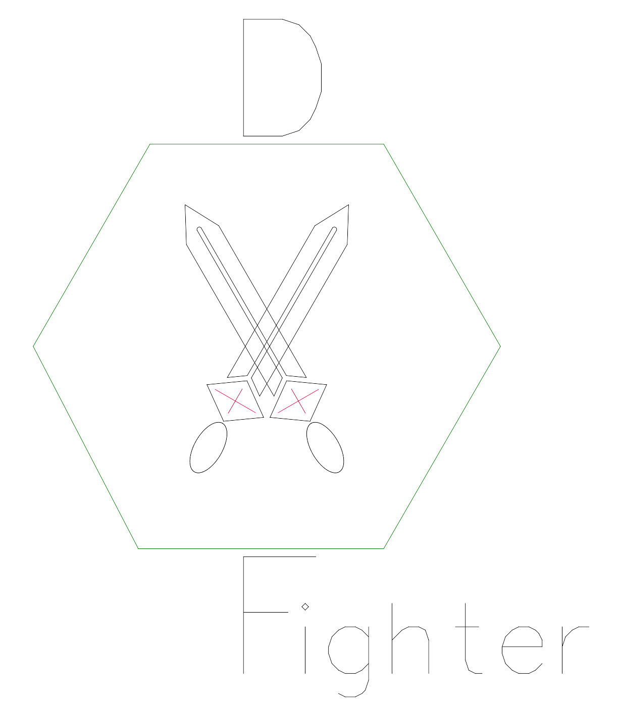

# DXFighter      
  
**!Currently not actively developed!**  
A new DXF writer and reader in PHP which outputs AC1012 (R15) DXF files.  
This project is based on [@digitalfotografen/DXFwriter](https://github.com/digitalfotografen/DXFwriter).
It's a great tool for basic DXF exports which don't rely on the newest DXF version.
Sadly I needed an export which includes ellipses so I've started writing my own exporter based on his work.
As we've needed this for a project the code was written as fast as possible so I need a lot of refactoring in the beginning.  
The basic implementation is done and you can use it for your projects. The library currently supports reading and writing for some entity types (see the list below).
If you need help please have a look at the example.php file or open an issue.

[Getting started guide](https://github.com/enjoping/DXFighter/wiki/GettingStarted) 
[Documentation](https://github.com/enjoping/DXFighter/wiki/Documentation) 
[Example code](example.php) 

## Current development status
A first implementation of reading and writing is done. At the moment no active development is done as I don't need this
project in production anymore. If you want to use DXFighter in your projects but need additional support for entity
types just open an Issue. I'm happy to help. 

### At the moment the library supports writing for following entity types:
 - Arcs
 - Circles
 - Ellipses
 - Lines
 - LWPolyline
 - Points
 - Polyline
 - Text
 - Spline
 - Insert
 
### At the moment the library supports reading for following entity types:
 - Ellipses
 - Lines
 - Polyline
 - Text
 - Spline
 - Insert

## License
This project is published under BSD 3-Clause licence. More information can be found in [the LICENSE file](LICENSE).
